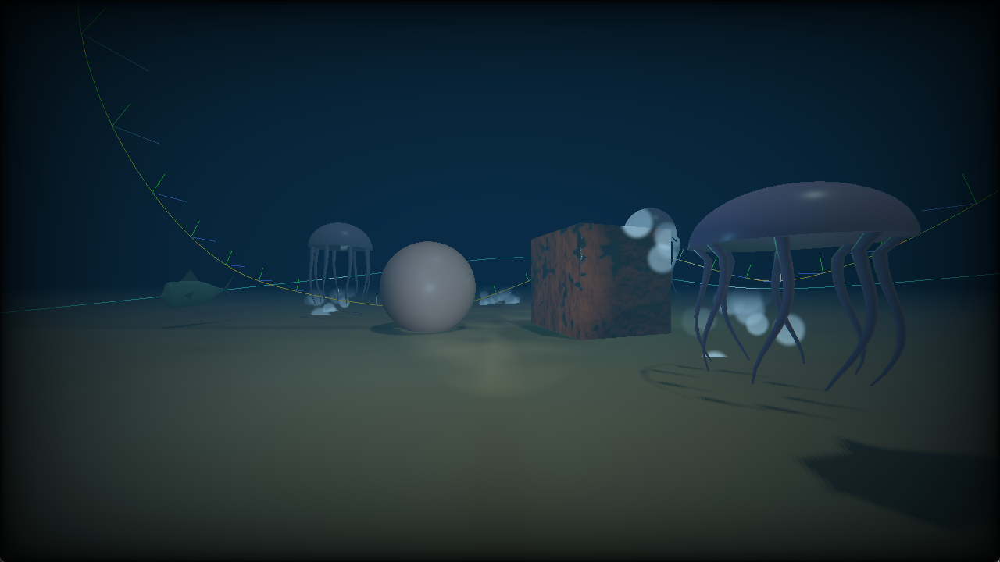

# Reef of the Lost Diver

Projekt na grafikę komputerową (GRK). Interaktywna podwodna scena 3D w C++ z OpenGL i GLSL.
Można sobie popływać po dnie, między rybami, wrakiem i koralami, z latarką nurka i świecącymi
stworzeniami dookoła.

## Grupa 13

- **Mróz** - kamera, światła (B13), bąbelki, interakcje, sklejenie całości, build
- **Nędzyński** - animacja pływania (A10), splajny + PTF, skybox
- **Olejnik** - shadery: PBR, normal mapping, cienie, obsługa wielu świateł

## Wybrane metody

- **A10** - animacja pływania ryb (deformacja w vertex shaderze)
- **B13** - ruchome światła (latarka nurka + bioluminescencja)

## Co już działa, a co dopiero w planach

Na razie stoi tylko szkielet projektu (okno, kamera, skybox, mgła, testowa scena).
Metody dopiero robimy. Statusy odhaczamy w trakcie, szczegóły zadań są w [TASKS.md](TASKS.md).

Metody obowiązkowe:

- Normal mapping *(Olejnik)*
- Oświetlenie PBR *(Olejnik)* — Cook-Torrance + mapy materiałów (OLE-01/02)
- Kamera na kwaternionach *(Mróz)*
- Shadow mapping *(Olejnik)*
- Parallel Transport Frames *(Nędzyński)*
- Podwodny skybox / cubemapa *(Nędzyński)*

Metody wybrane:

- **A10** - pływanie ryb (animacja w vertex shaderze) *(Nędzyński)*
- **B13** - ruchome światła: latarka + bioluminescencja *(Mróz)*

## Jak to zbudować

Cała ekipa robi w **Visual Studio na Windowsie**. Dokładna instrukcja (z przywracaniem bibliotek
i sprawą toolsetu) jest w [UnderwaterScene/BUILD.md](UnderwaterScene/BUILD.md). W skrócie:

1. Sklonuj repo:
  ```
   git clone https://github.com/Frothar/reef-of-the-lost-diver.git
  ```
2. Wrzuć folder `dependencies/` z frameworka z zajęć (`cw 7/dependencies`) do `UnderwaterScene/`.
  Ciężkie biblioteki Windows nie siedzą w repo, ale `glm` i `imgui` już tam są.
3. Otwórz `UnderwaterScene/UnderwaterScene.sln`, ustaw `Debug | x86` i odpal F5.

Jak masz VS 2022 i wyskoczy błąd o "v145" - kliknij prawym na projekt, "Retarget Projects",
wybierz v143. Więcej w BUILD.md.

## Sterowanie

Pływanie:

- `WSAD` - ruch (tam, gdzie patrzysz)
- mysz - rozglądanie
- `Q` / `E` - przechył (roll)
- `Spacja` / `Lewy Ctrl` - w górę / w dół
- `Lewy Shift` - przyspieszenie

Interakcje:

- `F` - latarka on/off
- `C` - zmiana koloru latarki (biały / ciepły / chłodny)
- `+` / `-` lub scroll - jasność latarki
- `B` - bioluminescencja on/off
- lewy klik - straszenie ryb w pobliżu

Reszta:

- `Caps Lock` - przełącza tryb myszy (rozglądanie ↔ kursor do klikania w panel)
- `H` - pokaż / ukryj panel ImGui (suwaki materiałów, świateł, mgły itd.)
- `Esc` - wyjście

## Zrzuty ekranu



*Ogólny widok: dno, meduzy, bioluminescencja, splajn ryb i mgła głębi.*


*Cień kuli na dnie (shadow mapping) i zardzewiały metal (PBR + normal mapping).*


*Panel ImGui z parametrami świateł, mgły, materiałów i ryb.*

## Struktura projektu

```
Projekt - Grafika/
├── README.md, TASKS.md, TIMELINE.md     # dokumentacja i plan
└── UnderwaterScene/                      # właściwy projekt (Visual Studio)
    ├── UnderwaterScene.sln / .vcxproj
    ├── CMakeLists.txt                    # build pod Maca/Linuksa (opcjonalny, nie testowany)
    ├── BUILD.md
    ├── src/                              # main.cpp, scena, klasy Core (Shader_Loader,
    │                                     #   Render_Utils, Texture, Camera), SOIL
    ├── shaders/                          # underwater + skybox (#version 410)
    ├── models/, textures/, screenshots/
    └── dependencies/                     # glm, imgui w repo; glew/glfw/assimp dorzucamy lokalnie
```

Klasy, które dopiero dojdą (rozpiska w TASKS.md): Model/Mesh, Light, ShadowMap, Skybox,
Spline (+PTF), FishAnimation, ParticleSystem, Scene, no i shadery pbr/shadow/fish/particle.

## Skąd braliśmy wiedzę

- [LearnOpenGL](https://learnopengl.com) - PBR, normal mapping, cienie, cubemapy, animacja
- [opengl-tutorial.org](https://www.opengl-tutorial.org) - kwaterniony, cienie
- [Parallel Transport (giordi91)](https://giordi91.github.io/post/2018-31-07-parallel-transport/) - PTF
- [Strona GRK](https://wp.faculty.wmi.amu.edu.pl/GRK.html) - framework i materiały z zajęć

Projekt robiony na zajęcia z grafiki komputerowej, rok 2025/2026.