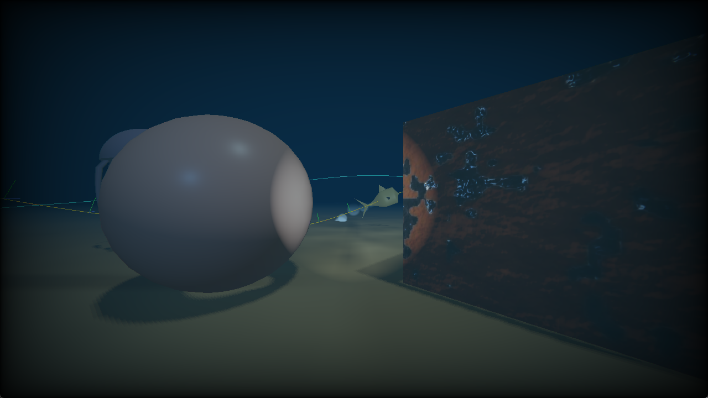
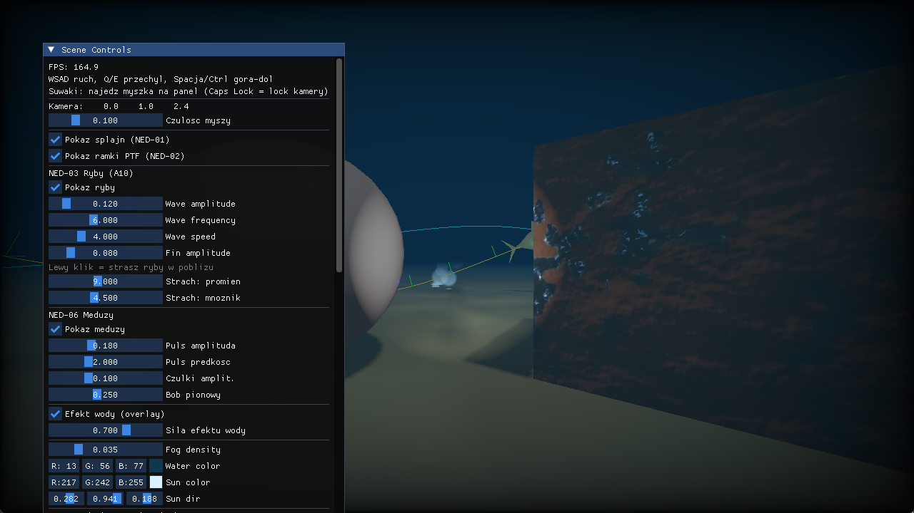

# 🌊 Reef of the Lost Diver

**Interaktywna podwodna scena 3D w C++ / OpenGL 4.1 / GLSL 410.**
Projekt zaliczeniowy z Grafiki Komputerowej (GRK), rok 2025/2026.

Pływasz nurkiem po dnie rafy — między koralami, ławicami ryb, meduzami i zatopionymi
wrakami — z latarką w dłoni i bioluminescencją dryfującą w toni. Scena łączy fizyczne
oświetlenie PBR, cienie, animację szkieletową i pełną podwodną atmosferę (mgła głębi,
kaustyki, smugi światła, bąbelki).


*Dno, korale, meduzy, bioluminescencja, ryby na splajnie i mgła głębi.*

---

## 👥 Grupa 13

| Osoba | Zakres odpowiedzialności |
|-------|--------------------------|
| **Mróz** | Kamera kwaternionowa, system świateł (B13), bąbelki, interakcje, integracja całości, build |
| **Nędzyński** | Animacja pływania (A10), splajny + Parallel Transport Frames, skybox, nurek (skinning) |
| **Olejnik** | Shadery: PBR, normal mapping, shadow mapping, obsługa wielu świateł, post-processing |

## 🎯 Wybrane metody dodatkowe

- **A10 — Skeletal / vertex-shader swimming animation** (animacja pływania stworzeń)
- **B13 — Moving point lights / submarine headlights** (ruchome światła: latarka nurka + bioluminescencja)

---

## 🧪 Mapa metod → kod → demo

Tabela mapuje każdą wymaganą metodę na konkretny plik/shader oraz pokazuje, jak ją
zademonstrować podczas obrony.

### Metody obowiązkowe

| Metoda | Gdzie w kodzie | Jak pokazać na demo |
|--------|----------------|---------------------|
| **Normal mapping** | [`pbr.vert`](shaders/pbr.vert) (macierz TBN) + [`pbr.frag`](shaders/pbr.frag) (próbkowanie mapy); mapy `_NormalGL` dla **dwóch** materiałów: piasek (dno) i zardzewiały metal (kostka) | W panelu sekcja **OLE-03**: przełącz „Normal map: piasek / metal" — widać pojawiające się/znikające wyboje powierzchni |
| **PBR lighting** | [`pbr.frag`](shaders/pbr.frag) — Cook-Torrance (GGX + Smith + Fresnel-Schlick), workflow metallic/roughness, HDR + Reinhard + gamma | W panelu **OLE-01**: suwaki Albedo / Metallic / Roughness na kuli — natychmiastowa zmiana materiału |
| **Quaternion camera** | [`QuaternionCamera.h`](src/QuaternionCamera.h) — orientacja jako kwaternion, składanie w układzie lokalnym | Rozglądanie myszą + `Q`/`E` (roll) + ruch w pionie — brak gimbal locka nawet patrząc prosto w górę/dół |
| **Shadow mapping** | [`shadow_depth.vert/frag`](shaders/shadow_depth.vert) (przebieg głębi, FBO 2048²) + `ShadowCalculation` w [`pbr.frag`](shaders/pbr.frag) — bias zależny od kąta, PCF 3×3/5×5 | Cień kuli i kostki na dnie; w panelu **OLE-04** suwaki bias i przełącznik „PCF 5×5" zmieniają miękkość krawędzi |
| **Parallel Transport Frames** | [`Spline.cpp`](src/Spline.cpp) — `buildFrames()` (double-reflection transport, Bishop/Bloomenthal) | W panelu „Pokaż ramki PTF" — kolorowe osie T(czerwona)/N(zielona)/B(niebieska) jadące wzdłuż krzywej; ryby płyną nosem wzdłuż splajnu bez skręcania |
| **Underwater skybox/cubemap** | [`skybox.vert/frag`](shaders/skybox.frag) + `textures/skybox/` — gradient głębi, animowane kaustyki, trick `pos.xyww` | Rozglądanie się: tło otacza scenę, nie przesuwa się przy ruchu kamery; góra jaśniejsza (powierzchnia), dół ciemny (głębia) |

### Metoda A10 — animacja pływania

| Wariant | Gdzie w kodzie | Jak pokazać |
|---------|----------------|-------------|
| **Deformacja w vertex shaderze** *(deklarowana A10)* | [`fish.vert`](shaders/fish.vert) — fala boczna ciała + ruch płetw, **analityczna korekta normalnej** z pochodnej deformacji | Obserwuj machające ogony ryb; **lewy klik** straszy ryby w pobliżu → frenzy ogona; panel **NED-03** reguluje amplitudę/częstotliwość/prędkość fali |
| **Pełny skinning szkieletowy** *(bonus)* | [`AnimatedModel.cpp`](src/AnimatedModel.cpp) + [`skinned.vert`](shaders/skinned.vert) — hierarchia kości, interpolacja klatek (slerp), GPU skinning | Nurek pływa animacją z Mixamo (55 kości, 5 klipów); panel pozwala zmienić klip i tempo |

### Metoda B13 — ruchome światła

| Element | Gdzie w kodzie | Jak pokazać |
|---------|----------------|-------------|
| **Latarka nurka (reflektor)** | `renderScene()` w [`scene_underwater.hpp`](src/scene_underwater.hpp) — spotlight podążający za nurkiem/kamerą; oświetlenie w [`pbr.frag`](shaders/pbr.frag) | `F` włącz/wyłącz, `C` zmiana koloru (biały/ciepły/chłodny), `+`/`-`/scroll jasność |
| **Bioluminescencja** | `renderScene()` — 3 dryfujące, pulsujące światła punktowe | `B` włącz/wyłącz; w panelu **OLE-05** regulacja intensywności, pulsowania i kolorów |

---

## 🐠 Co jeszcze jest w scenie (ponad wymagania)

- **Post-processing podwodny** ([`postprocess.frag`](shaders/postprocess.frag)) — tint głębi, mgła zależna od bufora głębi, aberracja chromatyczna, winieta (FBO RGB16F).
- **Mgła głębi i tłumienie koloru** — niebiesko-zielone zanikanie obiektów w dali.
- **Bąbelki** (CPU particle system, [`ParticleSystem.h`](src/ParticleSystem.h)) — wybijają z dna, dryfują i znikają.
- **Falujące wodorosty** ([`seaweed.vert`](shaders/seaweed.vert)) i **pulsujące meduzy** ([`jellyfish.vert`](shaders/jellyfish.vert)).
- **Wczytywanie modeli OBJ i GLB** (Assimp) — korale, ryby, wraki, nurek; tekstury osadzone w GLB ładowane z pamięci.
- **Panel ImGui** — sterowanie światłami, mgłą, materiałami, cieniami, rybami i post-processingiem w czasie rzeczywistym.

---

## 🎮 Sterowanie

### Pływanie
| Klawisz | Akcja |
|---------|-------|
| `W` `S` `A` `D` | ruch (w kierunku patrzenia) |
| mysz | rozglądanie |
| `Q` / `E` | przechył (roll) |
| `Spacja` / `Lewy Ctrl` | w górę / w dół |
| `Lewy Shift` (przytrzymany) | przyspieszenie |
| `V` | przełącz tryb 3. osoby ↔ free-cam |

### Interakcje (poza kamerą)
| Klawisz / akcja | Efekt |
|-----------------|-------|
| `F` | latarka włącz / wyłącz |
| `C` | kolor latarki (biały / ciepły / chłodny) |
| `+` / `-` lub scroll | jasność latarki |
| `B` | bioluminescencja włącz / wyłącz |
| **lewy klik** | straszenie ryb w pobliżu (uciekają, machają ogonem szybciej) |
| panel ImGui | regulacja świateł, mgły, materiałów, parametrów ryb i efektów |

### Pozostałe
| Klawisz | Akcja |
|---------|-------|
| `Caps Lock` | przełącza tryb myszy (rozglądanie ↔ kursor do panelu) |
| `H` | pokaż / ukryj panel ImGui (czysty widok na demo / screeny) |
| `Esc` | wyjście |

---

## 🔨 Budowanie

Projekt jest **wieloplatformowy** (OpenGL 4.1 / GLSL 410). Wspieramy obie ścieżki:
Visual Studio na Windows oraz CMake na macOS / Linux. Obie zostały sprawdzone.

### Windows — Visual Studio

1. Sklonuj repozytorium:
   ```
   git clone https://github.com/Frothar/reef-of-the-lost-diver.git
   ```
2. Dorzuć ciężkie biblioteki Windows do `dependencies/` — folder `dependencies/`
   z frameworka z zajęć (`cw 7/dependencies`), tak by były tam:
   `assimp/`, `glew-2.0.0/`, `glfw-3.3.8.bin.WIN32/`, `glm/`, `imgui/`.
   (`glm/` i `imgui/` są już w repo; resztę bierzesz z frameworka.)
3. Otwórz `UnderwaterScene.sln`, ustaw konfigurację **`Debug | x86`**
   (biblioteki są 32-bitowe — **nie** zmieniaj na x64) i naciśnij `F5`.

> Jeśli VS zgłosi brak toolsetu „v145": prawym na projekt → **Retarget Projects** →
> wybierz toolset, który masz (np. **v143** dla VS 2022). Szczegóły w
> [BUILD.md](BUILD.md).

Katalog roboczy jest ustawiony na folder projektu, więc ścieżki do `shaders/`,
`models/` i `textures/` działają z `F5`.

### macOS / Linux — CMake

Zależności (GLM i ImGui są w repo i kompilują się ze źródeł — instalujesz tylko resztę):

```bash
# macOS (Homebrew)
brew install cmake glfw glew assimp

# Linux (Debian/Ubuntu)
sudo apt install cmake libglfw3-dev libglew-dev libassimp-dev
```

Build i uruchomienie z katalogu projektu (root repozytorium):

```bash
cmake -S . -B build
cmake --build build -j8
./UnderwaterScene
```

Binarka trafia do katalogu projektu, więc ścieżki do zasobów rozwiązują się same.
Sprawdzone na Apple Silicon (OpenGL 4.1 przez Metal) oraz w VS na Windows.

---

## 🖼️ Zrzuty ekranu


*Cień kuli na dnie (shadow mapping) i zardzewiały metal (PBR + normal mapping).*


*Panel ImGui z parametrami świateł, mgły, materiałów, cieni i ryb.*

---

## 📁 Struktura projektu

```
reef-of-the-lost-diver/
├── README.md                          # ten plik
├── BUILD.md                           # szczegóły budowania
├── UnderwaterScene.sln / .vcxproj     # build Windows (Visual Studio)
├── CMakeLists.txt                     # build macOS / Linux
├── src/                               # kod C++
│   ├── main.cpp, scene_underwater.hpp # wejście + cała scena i pętla renderowania
│   ├── QuaternionCamera.h             # kamera kwaternionowa (metoda obowiązkowa)
│   ├── Spline.{h,cpp}                 # splajn Catmull-Rom + PTF (metoda obowiązkowa)
│   ├── FishAnimation.{h,cpp}          # ryby po splajnie z orientacją PTF
│   ├── AnimatedModel.{h,cpp}          # animacja szkieletowa nurka (A10)
│   ├── ParticleSystem.h               # bąbelki (CPU particles)
│   └── Render_Utils, Shader_Loader,   # klasy Core z zajęć
│       Texture, Camera, SOIL/
├── shaders/                           # 21 shaderów GLSL #version 410
│   ├── pbr.{vert,frag}                # PBR + normal mapping + cienie + wiele świateł
│   ├── shadow_depth.{vert,frag}       # przebieg cieni
│   ├── skybox.{vert,frag}             # podwodny skybox
│   ├── fish/sketchfish/skinned/       # animacja pływania (A10)
│   ├── jellyfish/seaweed.vert         # meduzy / wodorosty
│   └── postprocess, water_overlay,    # efekty pełnoekranowe
│       particle, debug_line
├── models/                            # OBJ + GLB (korale, ryby, wraki, nurek)
├── textures/                          # mapy PBR (sand, rusty_metal) + cubemapa
└── dependencies/                      # glm, imgui w repo; reszta dorzucana lokalnie
```

---

## 📚 Źródła

- [LearnOpenGL](https://learnopengl.com) — PBR, normal mapping, cienie, cubemapy, animacja szkieletowa
- [opengl-tutorial.org](https://www.opengl-tutorial.org) — kwaterniony, shadow mapping
- [Parallel Transport (giordi91)](https://giordi91.github.io/post/2018-31-07-parallel-transport/) — PTF
- [Strona kursu GRK](https://wp.faculty.wmi.amu.edu.pl/GRK.html) — framework i materiały z zajęć

Modele 3D pochodzą ze Sketchfab; tekstury PBR z ambientCG. Implementacja metod jest
samodzielnie zintegrowana z kodem projektu.

---

*Projekt na zajęcia z Grafiki Komputerowej, Wydział Matematyki i Informatyki, rok 2025/2026.*
