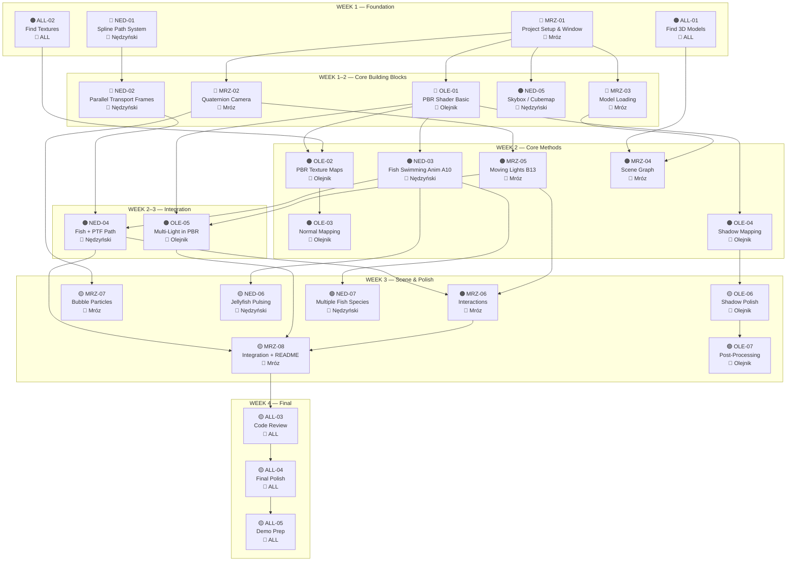

# ⏱️ Project Timeline — GRK Underwater Scene (A10 + B13)

> **Start:** Week of June 9, 2026  
> **Deadline:** Exam session (TBA, estimated ~4 weeks)

---

## 🔗 Dependency Graph



---

## 🛤️ Critical Path

> These are the tasks that, if delayed, will delay the entire project. **Prioritize these above everything.**

```
MRZ-01 (Setup) → OLE-01 (PBR basic) → OLE-02 (PBR textures) → OLE-03 (Normal mapping)
                                      → OLE-04 (Shadows)      → OLE-06 (Shadow polish)
                                      → NED-03 (Fish anim)    → NED-04 (Fish+PTF) → MRZ-08 (Integration)
                → MRZ-02 (Camera)     → MRZ-05 (Lights B13)   → OLE-05 (Multi-light)↗
                → MRZ-03 (Models)     → MRZ-04 (Scene graph)  → MRZ-06 (Interactions)↗
```

---

## 📅 Day-by-Day Kickoff Plan (Week 1)

> The first week is the most important — it unblocks everything else.

### Day 1–2 (Mon–Tue, June 9–10)

| Who | Task | Why first |
|-----|------|-----------|
| **Mróz** | `MRZ-01` Project setup, CMake, window | 🚨 **EVERYTHING depends on this** — Olejnik and Nędzyński can't test their code without a running window |
| **Nędzyński** | `NED-01` Spline path system | No dependencies — can work standalone with unit tests or a separate test app |
| **Olejnik** | `ALL-01` + `ALL-02` Find models & textures | Can't code shaders without test models; search Sketchfab/ambientCG now |
| **ALL** | `ALL-01` Help find models | Everyone browse for 30 min, share links |

### Day 3–4 (Wed–Thu, June 11–12)

| Who | Task | Why now |
|-----|------|---------|
| **Mróz** | `MRZ-02` Quaternion camera | Unblocked by `MRZ-01`; everyone needs the camera to test visually |
| **Mróz** | `MRZ-03` Model loading (start) | Can work in parallel with camera |
| **Nędzyński** | `NED-02` Parallel Transport Frames | Unblocked by `NED-01` |
| **Nędzyński** | `NED-05` Skybox (start) | Unblocked by `MRZ-01`; quick win for underwater feel |
| **Olejnik** | `OLE-01` PBR shader (basic) | Unblocked by `MRZ-01`; use hardcoded values on a test cube |

### Day 5–7 (Fri–Sun, June 13–15)

| Who | Task | Why now |
|-----|------|---------|
| **Mróz** | `MRZ-03` Model loading (finish) | Get at least one model rendering with textures |
| **Olejnik** | `OLE-01` PBR shader (finish) | Must be done before Week 2 tasks |
| **Nędzyński** | `NED-05` Skybox (finish) | Quick win — scene immediately looks more underwater |
| **Nędzyński** | `NED-02` PTF (finish) | Test with debug visualization (small boxes along spline) |

### ✅ End of Week 1 Checkpoint

> At this point, you should have:
> - [ ] A running window with a camera you can fly around
> - [ ] At least one model loaded and visible
> - [ ] A PBR-shaded object (even with hardcoded materials)
> - [ ] An underwater skybox in the background
> - [ ] A working spline + PTF system (even if only debug-rendered)

---

## 📅 Week 2 — Core Methods

### Start of week — parallel workstreams

```
Olejnik (rendering)          Nędzyński (animation)         Mróz (scene)
─────────────────            ───────────────────           ────────────
OLE-02 PBR textures          NED-03 Fish swimming          MRZ-04 Scene graph
    ↓                            anim (A10) ⭐               ↓
OLE-03 Normal mapping            ↓                        MRZ-05 Moving
    (parallel with ↓)       NED-04 Fish + PTF                 lights (B13) ⭐
OLE-04 Shadow mapping                                         ↓
    ↓                                                     OLE-05 Multi-light
    └──────────────────────────────────────────────────────→ (joint with Olejnik)
```

### ✅ End of Week 2 Checkpoint

> At this point, you should have:
> - [ ] PBR materials with normal maps on at least 2 surfaces
> - [ ] Working shadow map (wreck casting shadow on seabed)
> - [ ] At least one fish swimming with vertex-shader animation
> - [ ] Fish following a spline path with PTF orientation
> - [ ] Headlamp spotlight + at least one bioluminescent point light
> - [ ] All lights integrated into the PBR shader

---

## 📅 Week 3 — Scene Building & Integration

### Start of week — bringing it all together

```
Olejnik                      Nędzyński                     Mróz
─────────────────            ───────────────────           ────────────
OLE-06 Shadow polish         NED-06 Jellyfish pulsing     MRZ-06 Interactions
OLE-07 Post-processing       NED-07 Multiple fish          MRZ-07 Bubble particles
    (if time)                    (if time)                MRZ-08 Integration
                                                              + README
```

### ✅ End of Week 3 Checkpoint

> At this point, you should have:
> - [ ] **Complete scene** — all objects placed, all lights working
> - [ ] **All 6 mandatory methods** visibly working
> - [ ] **A10** — fish swimming and following paths
> - [ ] **B13** — headlamp + bioluminescent lights
> - [ ] **3+ interactions** — toggle light, color, scare fish, etc.
> - [ ] Bubbles rising (at least basic)
> - [ ] Everything runs together without crashes

---

## 📅 Week 4 — Polish & Presentation

### Final stretch

```
ALL members
─────────────────────────────────────────
ALL-03 Code review & bug fixing
ALL-04 Visual polish (colors, fog, composition)
ALL-05 Demo prep & presentation rehearsal
MRZ-08 Finalize README (Mróz)
    → Take screenshots
    → Record backup video
    → Rehearse 5-minute demo x2
```

### ✅ End of Week 4 Checkpoint (SHIP IT 🚀)

> - [ ] All methods implemented and demonstrable
> - [ ] README complete with screenshots and build instructions
> - [ ] 5-minute demo rehearsed
> - [ ] Code pushed to GitHub
> - [ ] Backup video recorded (in case of crash during demo)

---

## ⚠️ Risk Mitigation

| Risk | Impact | Mitigation |
|------|--------|------------|
| `MRZ-01` setup takes too long | 🔴 Blocks entire team | Reuse the course lab framework's libraries and helpers (GLEW, SOIL, Core/Render_Utils, Shader_Loader) — just port the build to CMake, don't rewrite the rendering basics from scratch |
| Fish model has no clean UVs | 🟠 Blocks `NED-03` | Use a simple low-poly fish from Sketchfab; test with a textured cube first |
| Shadow mapping has bad artifacts | 🟡 Visual quality | Start with large bias values; PCF hides most issues; `OLE-07` is dedicated to this |
| Skeletal animation too complex | 🟠 Blocks A10 | **Use vertex-shader deformation** (Option A) — it's simpler and fully sufficient for grading |
| Integration week chaos | 🟠 Project stability | Merge to `main` often; test together by end of Week 2 at latest |
| Demo crashes on exam day | 🔴 Grade impact | Record a backup video; have screenshots ready in README |

---

## 🔄 Sync Points

> Meet (in person or call) at these moments to check alignment:

| When | Purpose |
|------|---------|
| **End of Day 2** (June 10) | Confirm `MRZ-01` is done, share model/texture links |
| **End of Week 1** (June 15) | First integration — can everyone see a skybox + model + camera? |
| **Mid Week 2** (June 18) | Status check — are PBR/shadows/fish animation progressing? |
| **End of Week 2** (June 22) | **Major integration** — merge all branches, test everything together |
| **End of Week 3** (June 29) | **Feature freeze** — no new features, only bug fixes and polish |
| **2 days before exam** | Full demo rehearsal with timing |
