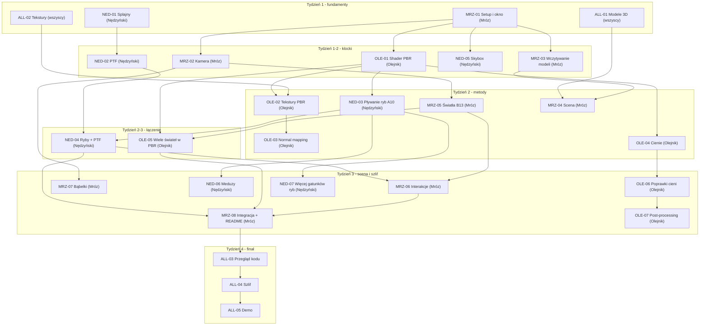

# Harmonogram - podwodna scena (A10 + B13)

Start: tydzień od 9 czerwca 2026. Deadline: sesja (jeszcze nie wiadomo dokładnie, liczymy
mniej więcej 4 tygodnie).

## Co od czego zależy



## Ścieżka krytyczna

To są rzeczy, które jak się opóźnią, to opóźnią cały projekt. Mają priorytet.

```
MRZ-01 (setup) → OLE-01 (PBR) → OLE-02 (tekstury) → OLE-03 (normal mapping)
                              → OLE-04 (cienie)    → OLE-06 (poprawki cieni)
                              → NED-03 (ryby)      → NED-04 (ryby+PTF) → MRZ-08 (integracja)
              → MRZ-02 (kamera) → MRZ-05 (światła) → OLE-05 (wiele świateł)
              → MRZ-03 (modele) → MRZ-04 (scena)   → MRZ-06 (interakcje)
```

## Pierwszy tydzień, dzień po dniu

Pierwszy tydzień jest najważniejszy, bo odblokowuje resztę.

**Dzień 1-2 (pon-wt, 9-10.06)**
- Mróz: MRZ-01 setup i okno. To jest blokada wszystkiego, bez działającego okna nikt nie
  przetestuje swojego kodu. (już zrobione)
- Nędzyński: NED-01 splajny. Nic nie blokuje, można robić od razu.
- Olejnik: ALL-01 + ALL-02, czyli szukanie modeli i tekstur. Bez tego nie ma na czym testować shaderów.
- Wszyscy: rozejrzyjcie się po Sketchfabie/ambientCG, wrzućcie linki.

**Dzień 3-4 (śr-czw, 11-12.06)**
- Mróz: MRZ-02 kamera (potrzebna wszystkim do oglądania sceny), zaczyna MRZ-03 modele.
- Nędzyński: NED-02 PTF, zaczyna NED-05 skybox (szybki efekt podwodnego klimatu).
- Olejnik: OLE-01 shader PBR na sztywnych wartościach, na testowej kostce.

**Dzień 5-7 (pt-niedz, 13-15.06)**
- Mróz: kończy MRZ-03, żeby chociaż jeden model się renderował z teksturą.
- Olejnik: kończy OLE-01 (musi być gotowe przed tygodniem 2).
- Nędzyński: kończy skybox i PTF (PTF najlepiej z podglądem, małe boxy wzdłuż splajnu).

Na koniec tygodnia 1 powinno być: latające okno z kamerą, jeden wczytany model, obiekt z PBR
(choćby na sztywnych materiałach), skybox w tle, działające splajny + PTF (choćby na debugu).

## Tydzień 2 - metody

Trzy równoległe wątki:
- Olejnik (rendering): OLE-02 tekstury PBR → OLE-03 normal mapping, OLE-04 cienie
- Nędzyński (animacja): NED-03 pływanie ryb (A10), potem NED-04 ryby + PTF
- Mróz (scena): MRZ-04 scena → MRZ-05 światła (B13), potem wspólnie OLE-05

Na koniec tygodnia 2 powinno być: materiały PBR z normal mapami na min. 2 powierzchniach,
działający shadow map (wrak rzuca cień na dno), jedna ryba pływająca z animacją w shaderze,
ryba jadąca po splajnie z PTF, latarka + przynajmniej jedno światło bioluminescencji, wszystkie
światła wpięte w shader PBR.

## Tydzień 3 - budowanie sceny i łączenie

- Olejnik: OLE-06 poprawki cieni, OLE-07 post-processing (jak starczy czasu)
- Nędzyński: NED-06 meduzy, NED-07 więcej gatunków ryb (jak starczy czasu)
- Mróz: MRZ-06 interakcje, MRZ-07 bąbelki, MRZ-08 integracja + README

Na koniec tygodnia 3: kompletna scena, wszystkie 6 metod obowiązkowych działa, A10 (ryby pływają
i jadą po ścieżkach), B13 (latarka + bioluminescencja), min. 3 interakcje, bąbelki, całość chodzi
bez wywałek.

## Tydzień 4 - szlif i prezentacja

Wszyscy:
- ALL-03 przegląd kodu i łapanie bugów
- ALL-04 szlif wizualny (kolory, mgła, kompozycja)
- ALL-05 przygotowanie demo i próba prezentacji
- Mróz domyka README, robimy screeny, nagrywamy backupowe wideo, ćwiczymy 5-minutowe demo

Koniec tygodnia 4 (oddajemy): wszystkie metody działają i da się je pokazać, README z opisem i
screenami, demo przećwiczone, kod na GitHubie, backupowe wideo na wszelki wypadek.

## Co może pójść nie tak

- MRZ-01 ciągnie się za długo - blokuje całą ekipę. Zaradzone: już zrobione, użyliśmy bibliotek
  i klas z frameworka z zajęć (GLEW, SOIL, Core/Render_Utils, Shader_Loader) w gotowym projekcie VS,
  bez przepisywania podstaw renderingu.
- Model ryby bez porządnego UV - blokuje NED-03. Bierzemy prostą low-poly rybę ze Sketchfaba,
  testujemy najpierw na teksturowanej kostce.
- Brzydkie artefakty cieni - zaczynamy od dużego biasu, PCF większość zakrywa, OLE-07 jest od polerki.
- Animacja szkieletowa za trudna - robimy deformację w vertex shaderze, prostsze i w zupełności
  wystarcza na ocenę.
- Bałagan przy łączeniu - mergujemy do main często, testujemy razem najpóźniej pod koniec tygodnia 2.
- Demo się wywali na egzaminie - mamy nagrane wideo i screeny w README.

## Kiedy się zgadać

- koniec 2. dnia (10.06): czy MRZ-01 gotowe, wymiana linków do modeli/tekstur
- koniec tygodnia 1 (15.06): pierwsze łączenie, czy każdy widzi skybox + model + kamerę
- środek tygodnia 2 (18.06): jak idzie PBR/cienie/animacja
- koniec tygodnia 2 (22.06): duże łączenie, merge wszystkich gałęzi, test całości
- koniec tygodnia 3 (29.06): feature freeze, tylko bugi i szlif
- 2 dni przed egzaminem: pełna próba demo z mierzeniem czasu
